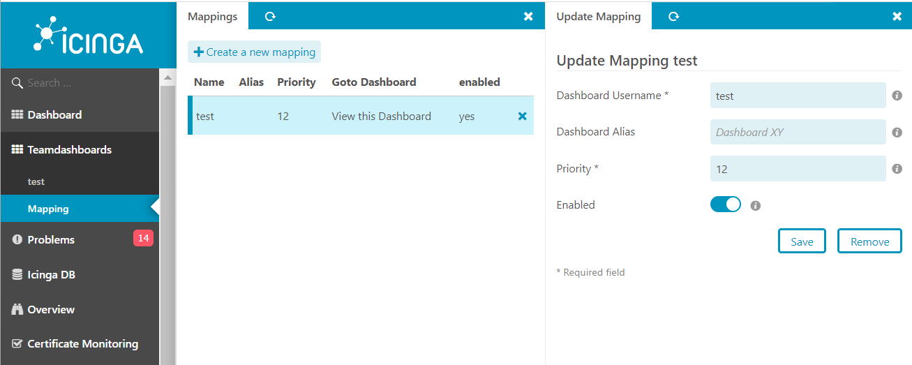

# Configuration 

## Module Configuration  

### Create a Mapping  

| Option                | Required | Description                              |
| --------------------- | -------- | -----------------------------------      |
| Dashboard Username    | **yes**  | The Username to fetch the dashboards from|
| Alias             | no  | Define an Alias that will be shown instead of the username as the menueitem|
| Priority             | **yes**  | Priority of the Dashboard in the menu |
| Enabled               | no       | Enable or disable this entry                    |

### List and update a Mapping  

## Role Configuration  
This module provides the following permissions:

If you want to restrict a users from accessing the dashboard mapping you can do this in the IcingaWeb2 Roles settings.
> teamdashboards/mapping

You will also see an entry for each available dashboard mapping and can allow groups or users to access this dashboard.
> teamdashboards/mapping/`<user>`

Every dashboard you are allowed to see is will be listed in the menu.
